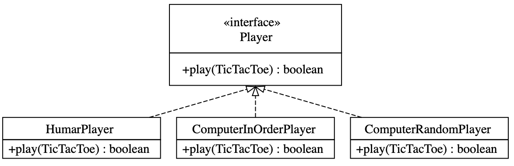
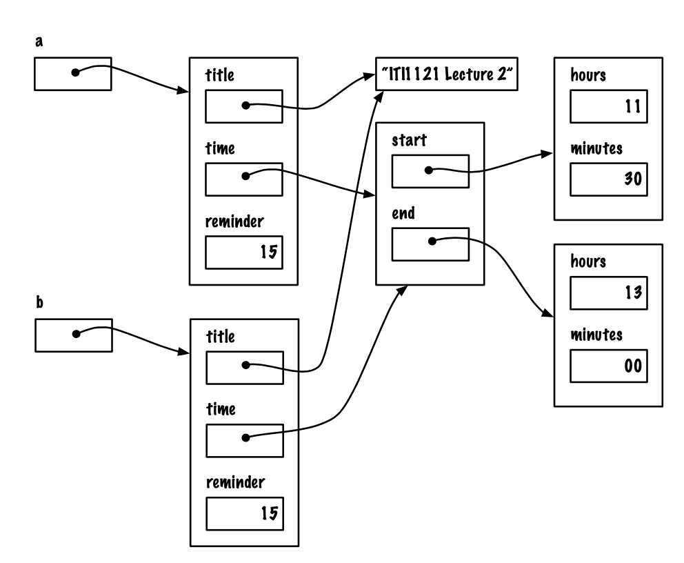
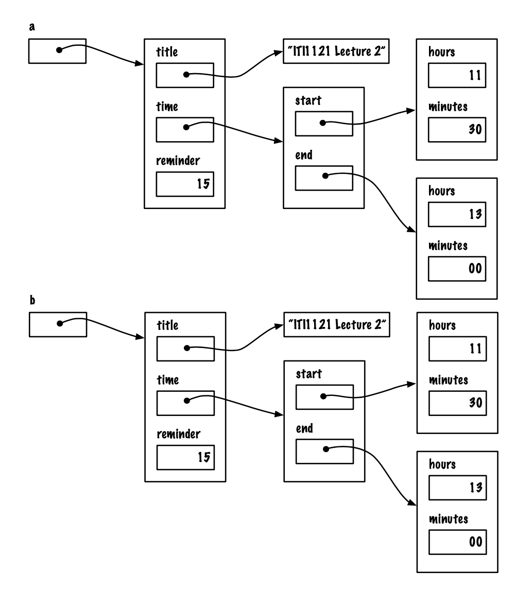

<center>
  <h1>ITI 1121. Introduction to Computing II</h1>
  <h3>Assignment 2</h3>
  <h3>Deadline: Jun 11, 2020 at 11pm</h3>
</center>

## Learning objectives

* Using Interfaces
* Polymorphism
* Experiment with Deep-Copy
* Experiment with lists and enumerations

## Introduction

In this assignment, we are continuing our work on the Tic-Tac-Toe game. In the previous assignment, we came up with a basic implementation of the game, that can be played by two humans. This time, we will first create a “computer player”, which isn't very smart at all but can at least play the game according to the rules. We will thus be able to play human against computer. We will then put this aside and work on enumerating all the possible games. That enumeration will be used later when we create a computer player which can play well.

## Human vs (Dumb) Machine

A very simple way to have a program play Tic-Tac-Toe is to simply have the program pick the first empty cell to play at each turn. Of course, such an implementation should be easy to beat, but at least it can be played against.

In order to design this solution, we want to introduce the concept of a **Player**. For now, we will have three kinds of players: the human player, and two dumb computer players. Later, we can introduce more types of players, e.g. a smart computer player, a perfect player etc. All of these are Players.




**Figure 1: The interface Player and the two classes implementing it.**

What we gain from this **Players** abstraction is that it is possible to organize a match between two players, and have these two players play a series of games, keeping score for the match etc., without having to worry about the type of players involved. We can have human vs human, human vs dumb computer, smart vs dumb computer players, or any combination of players, this does not impact the way the game is played: we have two players, and they alternate playing a move on the game until the game is over. The requirement to be able to do this is that all **Player** implement the same method, say **play()**, which can be called when it is that player's turn to play.

We can choose who plays whom, for example a human against a computer. The player who plays first, is initially chosen randomly. In subsequent games, the players alternate as first player. As usual, the first player plays X and the second player plays O so each player will alternate between playing playing X and playing O.

The following printout shows a typical game.


```
$ java GameMain
Player 2's turn.
Player 1's turn.

 X |   |
-----------
   |   |
-----------
   |   |

O to play:
```

Here, player 2 (the computer) was selected to start for the first game.

As can be seen, the computer player doesn't print out anything when it plays, it just makes its move silently. Then, it is player 1's turn (human). Following what we did in assignment 1, the HumanPlayer object first prints the game (here, we can see that the computer played cell 1, the first that was available) and then prompts the actual human (us, the user) for a move. Below, we see that the human has selected cell 2. The computer will then play (silently) and the human will be prompt again. It continues until the game finishes:

```
O to play: 2
Player 2's turn.
Player 1's turn.

 X | O | X
-----------
   |   |
-----------
   |   |

O to play:
```

And then.

```
O to play: 6
Player 2's turn.
Player 1's turn.

 X | O | X
-----------
 X |   | O
-----------
   |   |

O to play:
```

And then.

```
O to play: 7
Player 2's turn.
Player 1's turn.

 X | O | X
-----------
 X | X | O
-----------
 O |   |

O to play:
```

And then

```
O to play: 9
Player 2's turn.
Game over

 X | O | X
-----------
 X | X | O
-----------
 O | X | O

Result: DRAW
Play again (y)?:
```

This game finishes with a DRAW. The sentence "Game over" is printed after the last move (made by the computer in this case), then the final board is printed, and the outcome of the game ("Result: DRAW").

The user is then asked if they want to play again.

Here, we want to play another game. This time, the human will make the first move. Below, you can see the entire game, which is a human win. Then a third game is played, also a human win, and we stop playing after this.

```
Play again (y)?: y
Player 1's turn.

   |   |
-----------
   |   |
-----------
   |   |

X to play: 1

Player 2's turn.
Player 1's turn.

 X | O |
-----------
   |   |
-----------
   |   |

X to play: 4

Player 2's turn.
Player 1's turn.

 X | O | O
-----------
 X |   |
-----------
   |   |

X to play: 7
Game over

 X | O | O
-----------
 X |   |
-----------
 X |   |

Result: XWIN
Play again (y)?: y

Player 2's turn.
Player 1's turn.

 X |   |
-----------
   |   |
-----------
   |   |

O to play: 3

Player 2's turn.
Player 1's turn.

 X | X | O
-----------
   |   |
-----------
   |   |

O to play: 6

Player 2's turn.
Player 1's turn.

 X | X | O
-----------
 X |   | O
-----------
   |   |

O to play: 9
Game over

 X | X | O
-----------
 X |   | O
-----------
   |   | O

Result: OWIN
Play again (y)?: n
```

We are now ready to program our solution. We will reuse the implementation of the class TicTacToe from assignment 1 with a few small tweaks.


### Player

_Player_ is an interface. It defines only one method, the method play. Play is returns a boolean (did the player succeed in playing) and has one input parameter, a reference to a TicTacToe game.

### HumanPlayer

_HumanPlayer_ is a class which implements the interface Player. In its implementation of the method play, it first checks that the game is indeed playable (and returns false if it isn't), and then prompts the user for a valid input (similar to that from Assignment 1). Once an input has been provided, it plays in on the board and returns true.

### ComputerInOrderPlayer

_ComputerInOrderPlayer_ is a class which also implements the interface _Player_. In its implementation of the method play, it first checks that the game is playable (and returns false if it isn't), and then chooses the first available cell.

## ComputerRandomPlayer

Let us make a slightly smarter, but still dumb computer player.

_ComputerRandomPlayer_ is a class which also implements the interface _Player_. In its implementation of the method play, it first checks that the game is indeed playable (and returns false if it isn't), and then chooses randomly the next move and plays it on the game and returns. All the possible next moves have an equal chance of being played.

### GameMain

This class implements playing the game. You are provided with the initial part, but you will need to complete it. The entire game is played in the main method. A local variable **players**, a reference to an array of two players, is used to store the human and the computer player. You **must** use that array to store your **Player** references.

You need to finish the implementation of the main to obtain the specified behaviour. You need to ensure that the first player is initially chosen randomly, and that the first move alternate between both players in subsequent games.

Below is another sample run, this time on a 4x4 grid with a win length of 2. The human players makes a series of input mistakes along the way.

We have two additional arguments than we had from Assignment #1,  "player1" and "player2" which can be one of

* "h" for the human player
* "ic" for the in order computer player
* "rc" for the random computer player

```
$ java GameMain h ic 4 4 2
Player 1's turn.

   |   |   |
---------------
   |   |   |
---------------
   |   |   |
---------------
   |   |   |

X to play: 2
Player 2's turn.
Player 1's turn.

 O | X |   |
---------------
   |   |   |
---------------
   |   |   |
---------------
   |   |   |

X to play: 99
The value should be between 1 and 16

X to play: 2
Cell 2 has already been played with X

X to play: 6
Game over

 O | X |   |
---------------
   | X |   |
---------------
   |   |   |
---------------
   |   |   |

Result: XWIN
Play again (Y)?:n
```


## TicTacToe Enumerations

We are now looking at something else: game enumerations. We would like to generate all the possible games for a given size of grid and win size.

For example, if we take the default, 3x3 grid, there is 1 grid at level 0, namely:

```
   |   |
-----------
   |   |
-----------
   |   |
```

At level 1, there are 9 grids, namely:

```
 X |   |
-----------
   |   |
-----------
   |   |
```

```
   | X |
-----------
   |   |
-----------
   |   |
```

```
   |   | X
-----------
   |   |
-----------
   |   |
```

```
   |   |
-----------
 X |   |
-----------
   |   |
```

```
   |   |
-----------
   | X |
-----------
   |   |
```

```
   |   |
-----------
   |   | X
-----------
   |   |
```

```
   |   |
-----------
   |   |
-----------
 X |   |
```

```
   |   |
-----------
   |   |
-----------
   | X |
```

```
   |   |
-----------
   |   |
-----------
   |   | X
```

There are then 72 grids at level 2, too many to print here. In Appendix A, we provide the complete list of games for a 2x2 grid, with a win size of 2. Note that no game of level 4 appears on that list: it is simply impossible to reach level 3 and not win on a 2x2 grid with a win size of 2. In our enumeration, we do not list the same game twice, and we do not continue after a game has been won.

### Our Implementation

For this implementation, we are going to add a couple of new methods to our class **TicTacToe** and we will create a new class, **TicTacToeEnumerations**, to generate our games. We will store our games in a list of lists. We will have our own implementation of the abstract data type List very soon, but we do not have it yet. Therefore, exceptionally for ITI1X21, we are going to use a ready-to-use solution. In this case, we will use java.util.LinkedList. The documentation is available at https://docs.oracle.com/javase/9/docs/api/java/util/LinkedList.html.

The goal is to create a list of lists: each list will have all the different games for a given level. Consider again the default, 3x3 grid. Our list will have 10 elements.

* The first element is the list of 3x3 grid at level 0. There is 1 such grid, so this list has 1 element.
* The second element is the list of 3x3 grid at level 1. There are 9 such grids, so this list has 9 elements.
* The third element is the list of 3x3 grid at level 2. There are 72 such grids, so this list has 72 elements.
* The fourth element is the list of 3x3 grid at level 3. There are 252 such grids, so this list has 252 elements.
* The fifth element is the list of 3x3 grid at level 4. There are 756 such grids, so this list has 756 elements.

...

* The ninth element is the list of 3x3 grid at level 8. There are 390 such grids, so this list has 390 elements.
* The tenth element is the list of 3x3 grid at level 9. There are 78 such grids, so this list has 78 elements.

The class **EnumerationsMain.java** is provided to you. Here are a few typical runs:

```
$ java EnumerationsMain
======= level 0 =======: 1 element(s) (1 still playing)
======= level 1 =======: 9 element(s) (9 still playing)
======= level 2 =======: 72 element(s) (72 still playing)
======= level 3 =======: 252 element(s) (252 still playing)
======= level 4 =======: 756 element(s) (756 still playing)
======= level 5 =======: 1260 element(s) (1140 still playing)
======= level 6 =======: 1520 element(s) (1372 still playing)
======= level 7 =======: 1140 element(s) (696 still playing)
======= level 8 =======: 390 element(s) (222 still playing)
======= level 9 =======: 78 element(s) (0 still playing)
that's 5478 games
564 won by X
316 won by O
78 draw
```

We can specify the grid size and the number of in a row to win

```
$ java EnumerationsMain 3 3 2
======= level 0 =======: 1 element(s) (1 still playing)
======= level 1 =======: 9 element(s) (9 still playing)
======= level 2 =======: 72 element(s) (72 still playing)
======= level 3 =======: 252 element(s) (112 still playing)
======= level 4 =======: 336 element(s) (136 still playing)
======= level 5 =======: 436 element(s) (40 still playing)
======= level 6 =======: 116 element(s) (4 still playing)
======= level 7 =======: 12 element(s) (0 still playing)
that's 1234 games
548 won by X
312 won by O
0 draw
```

Here is a small 2x2 grid.

```
$ java EnumerationsMain 2 2 2
======= level 0 =======: 1 element(s) (1 still playing)
======= level 1 =======: 4 element(s) (4 still playing)
======= level 2 =======: 12 element(s) (12 still playing)
======= level 3 =======: 12 element(s) (0 still playing)
that's 29 games
12 won by X
0 won by O
0 draw
```

Here is an _impossible to win_ 2x2 grid.

```
$ java EnumerationsMain 2 2 3
======= level 0 =======: 1 element(s) (1 still playing)
======= level 1 =======: 4 element(s) (4 still playing)
======= level 2 =======: 12 element(s) (12 still playing)
======= level 3 =======: 12 element(s) (12 still playing)
======= level 4 =======: 6 element(s) (0 still playing)
that's 35 games
0 won by X
0 won by O
6 draw
```

Here is a larger 5x2 board.

```
$ java EnumerationsMain 5 2 3
======= level 0 =======: 1 element(s) (1 still playing)
======= level 1 =======: 10 element(s) (10 still playing)
======= level 2 =======: 90 element(s) (90 still playing)
======= level 3 =======: 360 element(s) (360 still playing)
======= level 4 =======: 1260 element(s) (1260 still playing)
======= level 5 =======: 2520 element(s) (2394 still playing)
======= level 6 =======: 3990 element(s) (3798 still playing)
======= level 7 =======: 3990 element(s) (3290 still playing)
======= level 8 =======: 2580 element(s) (2162 still playing)
======= level 9 =======: 1032 element(s) (646 still playing)
======= level 10 =======: 150 element(s) (0 still playing)
that's 15983 games
1212 won by X
610 won by O
150 draw
```

### TicTacToe Changes

We need to add three new public methods to the class TicTacToe:

#### cloneNextPlay

```java
public TicTacToe cloneNextPlay(int nextMove)
```

The `cloneNextPlay` is used to create a new instance of the class `TicTacToe`, based on the current instance (aka `this`). The new instance will copy (also known as clone) the current state of the game, and will then apply the `nextMove`. For example, imagine the following game:

```
 O |   | X
-----------
 X |   |
-----------
   |   |
```

A call to

```java
game.cloneNextPlay(7);
```

Returns a new game as follows:

```
 O |   | X
-----------
 X |   |
-----------
 O |   |
```

One important consideration in implementing this method is that the underlying game should not be modified by the call. Have a look at Appendix B to better understand what is required to achieve this.


#### equals

```java
public boolean equals(Object obj)
```

The `equals` compares the current game with the game referenced by other object. This method returns true if and only if both games are considered the same: they have the same characteristics, and their board is in the same state.

#### emptyPositions

The `emptyPositions` returns an array of positions that are empty and available to be played on. The results are 1-based (not zero).

For example, imagine the following game:

```
 O |   | X
-----------
 X |   |
-----------
   |   |
```

A call to

```java
game.emptyPositions();
```

Returns

```java
[2, 5, 6, 7, 8, 9]
```

### TicTacToeEnumerations

This new class computes has a constructor the same as `TicTacToe`

```java
public TicTacToeEnumerations(int aNumRows, int aNumColumns, int aSizeToWin)
```

And then implement the method `generateAllGames` to generate the list of lists of games.

```java
public LinkedList<LinkedList<TicTacToe>> generateAllGames()
```

This method returns the (Linked) list of (Linked) lists of TicTacToe references that we are looking for, for the games on a grid `numRows` x `numColumns` with a particular `sizeToWin`. As explained, each of the (secondary) lists contains the lists of references to the game of the same level. There are three important factors to take into account when building the list:

* We only build games up to their winning point (or until they reach a draw). We never extend a game that is already won.
* We do not duplicate games. There are several ways to reach the same state, so make sure that the same game is not listed several times.
* We do not include empty lists. As can be seen in A, we stop our enumeration once all the games are finished. In the 2x2 case with a win size of 2, since all the games are finished after 3 moves, the list of lists has only 4 elements: games after 0 move, games after 1 move, games after 2 moves and games after 3 moves.

## JUnit

We provide a set of JUnit tests. These tests should help ensure that your implementation is correct. They can also help clarify the expected behavior of this class.

Please read the [junit instructions](JUNIT.en.md) for help with running the tests.


## Submission

Please read the [Submission Guidelines](SUBMISSION.en.md) carefully.
Submission errors will affect your grades.

Submit the following files.

* STUDENT.md
* ComputerInOrderPlayer.java
* ComputerRandomPlayer.java
* GameMain.java
* HumanPlayer.java
* TicTacToe.java
* TicTacToeEnumerations.java

Submit the following files, but they should not be changed.

* CellValue.java
* EnumerationsMain.java
* GameState.java
* Player.java
* Utils.java

This assignment can be done in groups of 2 +/- 1 person.  Ensure that `STUDENT.md` includes the names of all participants; only submit 1 solution per group.

## Academic Integrity

This part of the assignment is meant to raise awareness concerning plagiarism and academic integrity. Please read the following documents.

* https://www.uottawa.ca/administration-and-governance/academic-regulation-14-other-important-informati
* https://www.uottawa.ca/vice-president-academic/academic-integrity

Cases of plagiarism will be dealt with according to the university regulations. By submitting this assignment, you acknowledge:

1. I have read the academic regulations regarding academic fraud.
2. I understand the consequences of plagiarism.
3. With the exception of the source code provided by the instructors for this course, all the source code is mine.
4. I did not collaborate with any other person, with the exception of my partner in the case of team work.

* If you did collaborate with others or obtained source code from the Web, then please list the names of your collaborators or the source of the information, as well as the nature of the collaboration. Put this information in the submitted README.txt file. Marks will be deducted proportional to the level of help provided (from 0 to 100%).

## Appendix A: Enumerating all games of a 2x2 grid

```
======= level 0 =======: 1 element(s)
   |
-------
   |
```

```
======= level 1 =======: 4 element(s)
 X |
-------
   |

   | X
-------
   |

   |
-------
 X |

   |
-------
   | X
```

```
======= level 2 =======: 12 element(s)

 X | O
-------
   |

 X |
-------
 O |

 X |
-------
   | O

 O | X
-------
   |

   | X
-------
 O |

   | X
-------
   | O

 O |
-------
 X |

   | O
-------
 X |

   |
-------
 X | O

 O |
-------
   | X

   | O
-------
   | X

   |
-------
 O | X
```

```
======= level 3 =======: 12 element(s)

 X | O
-------
 X |

 X | O
-------
   | X

 X | X
-------
 O |

 X |
-------
 O | X

 X | X
-------
   | O

 X |
-------
 X | O

 O | X
-------
 X |

 O | X
-------
   | X

   | X
-------
 O | X

   | X
-------
 X | O

 O |
-------
 X | X

   | O
-------
 X | X
```

## Appendix B: Shallow copy versus Deep copy

As you know, objects have variables which are either a primitive type, or a reference type. Primitive variables hold a value from one of the language primitive type, while reference variables hold a reference (the address) of another object (including arrays, which are objects in Java).

If you are copying the current state of an object, in order to obtain a duplicate object, you will create a copy of each of the variables. By doing so, the value of each instance primitive variable will be duplicated (thus, modifying one of these values in one of the copy will not modify the value on the other copy). However, with reference variables, what will be copied is the actual reference, the address of the object that this variable is pointing at. Consequently, the reference variables in both the original object and the duplicated object will point at the same address, and the reference variables will refer to the same objects. This is known as a shallow copy: you indeed have two objects, but they share all the objects pointed at by their instance reference variables. The Figure B provides an example: the object referenced by variable b is a shallow copy of the object referenced by variable a: it has its own copies of the instances variables, but the references variables title and time are referencing the same objects.

Often, a shallow copy is not adequate: what is required is a so-called deep copy. A deep copy differs from a shallow copy in that objects referenced by reference variable must also be recursively duplicated, in such a way that when the initial object is (deep) copied, the copy does not share any reference with the initial object. The Figure B provides an example: this time, the object referenced by variable b is a deep copy of the object referenced by variable a: now, the references variables title and time are referencing different objects. Note that, in turn, the objects referenced by the variable time have also been deep-copied. The entire set of objects reachable from a have been duplicated.



**Figure 2: A example of a shallow copy of objects.**



**Figure 3: A example of a deep copy of objects.**

You can read more about shallow versus deep copy on Wikipedia:

https://en.wikipedia.org/wiki/Object_copying