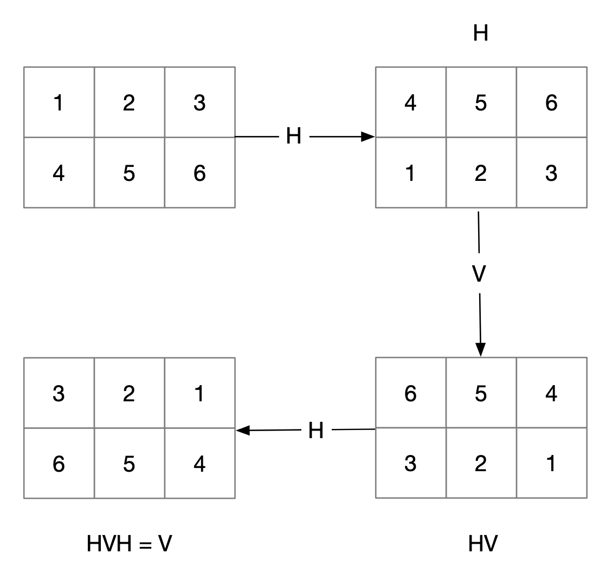
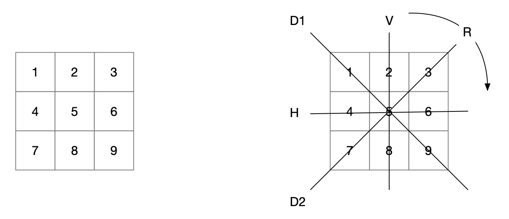
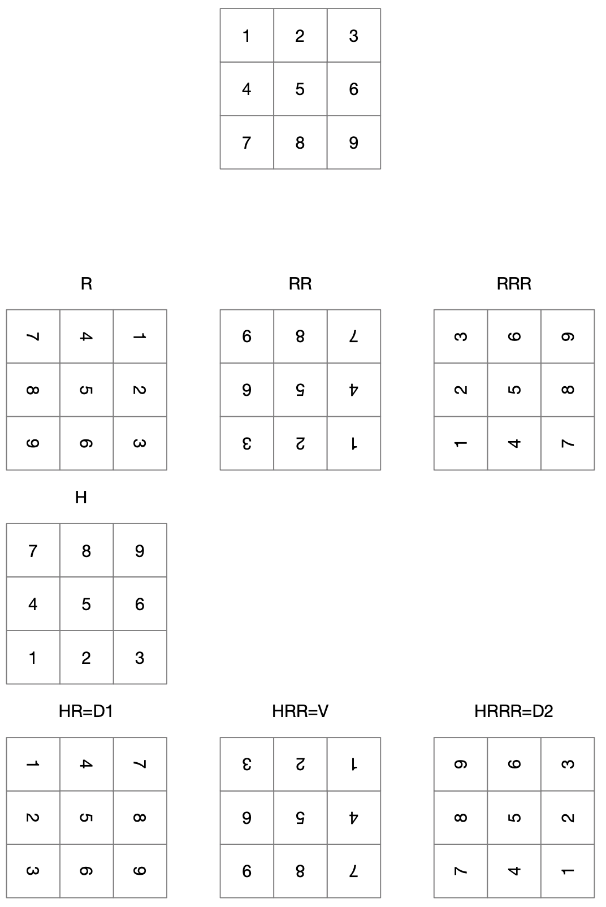

<center>
  <h1>ITI 1121. Introduction to Computing II</h1>
  <h3>Assignment 3</h3>
  <h3>Deadline: Jul 09, 2020 at 11pm</h3>
</center>

## Learning objectives

* Iterating through different states
* Using indirection

## Introduction

In the previous assignment, we allowed symmetric games to be processed. In this assignment, we will remove those symmetric games to make our search space smaller.

## Symmetries and iterators

When we created our list of games in Q2 of assignment 2, we added a lot of solutions that were essentially identical, simply a symmetry of other games already listed.

Let’s looks at symmetries in a nxm grid. Let’s first assume that n 􏰀 m, that is, the grid is not square. In the case of a non-square grid, we have essentially two symmetries: vertical flip, and horizontal flip (Figure 1).


**Figure 1: Non-square boards have 2 axes of symmetry.**

For each such non-square nxm grid, there are up to 3 different but symmetrical grids: the one obtain with a vertical symmetry, the one obtained with a horizontal symmetry, and the one obtain with a combination of both symmetries (Figure 2).


**Figure 2: Non-square boards have up to 3 symmetrical equivalent grids.**

Something that will come in handy is that it is possible to iterate through all of these symmetries by repeatedly applying transformations, for example the series horizontal, then vertical, then horizontal symmetry will give you all four boards, as shown Figure 3.


**Figure 3: Enumerating all non-square symmetrical boards.**

Things are a little bit more complicated when the grid is square. In addition to horizontal and vertical symmetries, we have both diagonals, and well as rotation (Figure 4).


**Figure 4: Square board have 4 axes of symmetry, and can be rotated 90 degrees as well**


Each grid now gives us up to 7 other different but symmetrical grids, shown Figure 5.


**Figure 5: Square boards have 7 symmetrical equivalent boards.**


Here again, it is possible to iterate through all 8 different but symmetrical equivalent (square) grids, for ex- ample with the sequence rotation-rotation-rotation-horizontal symmetry-rotation-rotation-rotation, as illustrated Figure 6.


**Figure 6: Enumerating all symmetrical square boards.**

## Step 1: Create Transfomer.java

From the discussion above, we see that implementing the horizontal symmetry, the vertical symmetry and the 90 degree (clockwise) rotation is enough to get every possibly symmetrical grid, for both square and non square grids.  We are going to create a new class Transformer to handle all-things-transformation.

```java
public class Transformer {

}
```

### Add a Enumeration of rotation types

We will want to add an enumeration of all possible rotations by creating a `enum` within our `Transformer` class.

```java
  /**
   * An static enum  for the types of
   * allowable transformations
   */
  public static enum Type {
    UNKNOWN,
    IDENTITY,
    ROTATION,
    VERTICAL_SYMMETRY,
    HORIZONAL_SYMMETRY,
  }
```

The `UNKNOWN` is useful for testing, and the `IDENTITY` does no rotation at all

### Implement the transformations

We are going to add five methods in Transformer.java to do this.  One of which is implemented below for your.

This method uses the enum from above, and calls the underlying transformation.

```java
  /**
   * Applies the transformation specified as parameter
   * to board
   *
   * If the transformation was successful return true, if not return false;
   */
  public static boolean transform(Type transformation, int numRows, int numColumns, int[] board) {

    switch(transformation) {
    case IDENTITY:
      return identity(numRows, numColumns, board);
    case ROTATION:
      return rotate90(numRows, numColumns, board);
    case VERTICAL_SYMMETRY:
      return verticalFlip(numRows, numColumns, board);
    case HORIZONAL_SYMMETRY:
      return horizontalFlip(numRows, numColumns, board);
    default:
      return false;
    }
  }
```

In keeping with our previous approach, the grids are going to be stored using a one dimensional array. For reasons that will become clear very soon, we will use an array of integers for our grid. Each of the methods will have three parameters: the number of rows and the number of columns of the grid, and a reference to the array of integers representing the grid. You need to implement the class methods in the class Transformer.java, that is:

#### Identity

```java
public static boolean identity(int numRows, int numColumns, int[] board) {
```

Sets the board to the identity board where the value at each index is the index itself (in other words do a "no flip" flip).  Here we ignore the current values withiin the provided board and populate each index with its index value.

For example, the identity board of a 3x3 game is

```
 0 | 1 | 2
----------
 3 | 4 | 5
----------
 6 | 7 | 8
```

#### Horizonal Flip

```java
public static void horizontalFlip(int numRows, int numRows, int[] board)
```

Performs a horizontal symmetry on the elements in the n (numRows) x m (numColumns) grid stored in the array reference by board. The elements in the array referenced by board are modified accordingly (see example below).

If we consider a 3x3 board.

```
 1 | 2 | 3
----------
 4 | 5 | 6
----------
 7 | 8 | 9
```

The updated horizontally flipped board would be

```
 7 | 8 | 9
----------
 4 | 5 | 6
----------
 1 | 2 | 3
```

#### Vertical Flip

```java
public static void verticalFlip(int numRows, int numRows, int[] board)
```

Performs a vertical symmetry on the elements in the n (numRows) x m (numColumns) grid stored in the array reference by boardIndexes. The elements in the array referenced by boardIndexes are modified accordingly (see example below).

If we consider a 3x3 board

```
 1 | 2 | 3
----------
 4 | 5 | 6
----------
 7 | 8 | 9
```

The updated vertically flipped board would be

```
 3 | 2 | 1
----------
 6 | 5 | 4
----------
 9 | 8 | 7
```

#### Rotate 90 Degrees

```java
public static void rotate(int numRows, int numRows, int[] board);
```

Rotates clockwise by 90 degrees the elements in the n (numRows) x m (numColumns) grid stored in the array reference by boardIndexes. The elements in the array referenced by boardIndexes are modified accordingly (see example below).

If we consider a 3x3 board

```
 1 | 2 | 3
----------
 4 | 5 | 6
----------
 7 | 8 | 9
```

The updated 90 rotated board would be

```
 7 | 4 | 1
 ----------
 8 | 5 | 2
 ----------
 9 | 6 | 3
```

Note that you can only rotate n x n boards.

### Manually Testing Transformer

All methods must check the provided inputs and handle all possible cases as required. The class Transformer.java comes with the following tests:

```java
  private static void test(int numRows, int numColumns) {
    int[] test;
    test = new int[numRows*numColumns];

    System.out.println("testing " + numRows + " numRows and " + numColumns + " numColumns.");

    identity(numRows, numColumns, test);
    System.out.println(java.util.Arrays.toString(test));

    horizontalFlip(numRows,numColumns,test);
    System.out.println("HF => " + java.util.Arrays.toString(test));

    horizontalFlip(numRows,numColumns,test);
    System.out.println("HF => " + java.util.Arrays.toString(test));

    verticalFlip(numRows,numColumns,test);
    System.out.println("VF => " + java.util.Arrays.toString(test));

    verticalFlip(numRows,numColumns,test);
    System.out.println("VF => " + java.util.Arrays.toString(test));

    for(int i = 0; i < 4; i++) {
      boolean didTransform = rotate90(numRows,numColumns,test);
      if (didTransform) {
        System.out.println("ROT => " + java.util.Arrays.toString(test));
      }
    }
  }

  public static void main(String[] args) {
    int[] test;
    int numRows, numColumns;

    test(2,2);
    test(2,3);
    test(3,3);
    test(4,3);
    test(4,4);
  }
```

Running the test above should produce the following output:

```java
$ javac Transformer.java
$ java Transformer
```

The output would look like

```java
testing 2 numRows and 2 numColumns.
[0, 1, 2, 3]
HF => [2, 3, 0, 1]
HF => [0, 1, 2, 3]
VF => [1, 0, 3, 2]
VF => [0, 1, 2, 3]
ROT => [2, 0, 3, 1]
ROT => [3, 2, 1, 0]
ROT => [1, 3, 0, 2]
ROT => [0, 1, 2, 3]
testing 2 numRows and 3 numColumns.
[0, 1, 2, 3, 4, 5]
HF => [3, 4, 5, 0, 1, 2]
HF => [0, 1, 2, 3, 4, 5]
VF => [2, 1, 0, 5, 4, 3]
VF => [0, 1, 2, 3, 4, 5]
testing 3 numRows and 3 numColumns.
[0, 1, 2, 3, 4, 5, 6, 7, 8]
HF => [6, 7, 8, 3, 4, 5, 0, 1, 2]
HF => [0, 1, 2, 3, 4, 5, 6, 7, 8]
VF => [2, 1, 0, 5, 4, 3, 8, 7, 6]
VF => [0, 1, 2, 3, 4, 5, 6, 7, 8]
ROT => [6, 3, 0, 7, 4, 1, 8, 5, 2]
ROT => [8, 7, 6, 5, 4, 3, 2, 1, 0]
ROT => [2, 5, 8, 1, 4, 7, 0, 3, 6]
ROT => [0, 1, 2, 3, 4, 5, 6, 7, 8]
testing 4 numRows and 3 numColumns.
[0, 1, 2, 3, 4, 5, 6, 7, 8, 9, 10, 11]
HF => [9, 10, 11, 6, 7, 8, 3, 4, 5, 0, 1, 2]
HF => [0, 1, 2, 3, 4, 5, 6, 7, 8, 9, 10, 11]
VF => [2, 1, 0, 5, 4, 3, 8, 7, 6, 11, 10, 9]
VF => [0, 1, 2, 3, 4, 5, 6, 7, 8, 9, 10, 11]
testing 4 numRows and 4 numColumns.
[0, 1, 2, 3, 4, 5, 6, 7, 8, 9, 10, 11, 12, 13, 14, 15]
HF => [12, 13, 14, 15, 8, 9, 10, 11, 4, 5, 6, 7, 0, 1, 2, 3]
HF => [0, 1, 2, 3, 4, 5, 6, 7, 8, 9, 10, 11, 12, 13, 14, 15]
VF => [3, 2, 1, 0, 7, 6, 5, 4, 11, 10, 9, 8, 15, 14, 13, 12]
VF => [0, 1, 2, 3, 4, 5, 6, 7, 8, 9, 10, 11, 12, 13, 14, 15]
ROT => [12, 8, 4, 0, 13, 9, 5, 1, 14, 10, 6, 2, 15, 11, 7, 3]
ROT => [15, 14, 13, 12, 11, 10, 9, 8, 7, 6, 5, 4, 3, 2, 1, 0]
ROT => [3, 7, 11, 15, 2, 6, 10, 14, 1, 5, 9, 13, 0, 4, 8, 12]
ROT => [0, 1, 2, 3, 4, 5, 6, 7, 8, 9, 10, 11, 12, 13, 14, 15]
```

## Step 2: Generating every non-symmetrical nxm games

In assignment 2, we created a method that generates all the possible games for a given grid size. That method would only add a game to the list if the game was not equal to a game that was already there. Therefore, from that viewpoint, all we need to do is slightly update that method to only add a game it if not equal or symmetrical to a game that is already there.

### Update equals to include symmetric boards

Update the `equals` method of `TicTacToe` to also consider symmetrical games as equal.  Once updated, the `generateAllGames` in `TicTacToeEnumerations` will generate the list of lists we are looking for.

If we consider a 3x3 board.

```
 X |   |
----------
   |   |
----------
   |   |
```

It should be updated so that now considers the following symmetrical board also equal

```
   |   | X
----------
   |   |
----------
   |   |
```

Read more to figure out how to make this change.


### Indirection

In order to update the `equals` in `TicTacToe`, we will have to loop through all the possible symmetrical games to see if we have a match. Of course, we could apply the symmetries on the board itself. We would apply transformations to the board until it either matches the board of the game we are comparing it with (in which case it is symmetrical) or we run out of symmetrical games (in which case it is not symmetrical).

However, changing the board itself might have unwanted side effects. For example, imagine that we are printing the game to the user. What would happen is that since the board is modified through symmetrical equivalent games, the game presented to the used might be a dierent but symmetrical game every time, which would clearly not be good.

Therefore, we are going to introduce a level of indirection to compute our symmetries.

```java
  /**
   * The transformed board
   * Initialized as the identity (board), i.e. no changes
   * it will store the transformed index of each value
   * in the underlying board
   */
  int[] boardIndexes;

  /**
   * What are all the allowable transformations of this board
   * There are more transformations for square boards
   */
  int allowableIndex;
  Transformer.Type[] allowable;
```

The board itself will remain unchanged, but we will use another array that will map the indexes of the board to their current symmetrical locations. We will use an instance variable, the array of integer `boardIndexes` to store the indirection.

Initially, since there is no transformation, we always have `board[i]==board[boardIndexes[i]]` (the `identity` transformation). But after some symmetries have been applied to the game, `boardIndexes[i]` stores where the index i of the board is mapped to in the symmetry.


### Iterating Through The Board

To iterate through symmetric board we need a strategy. Each board has either four or eight symmetrical positions depending if it is square or not. We propose a convenient mechanism to iterate through all possible positions, using new instance methods

```
  /**
   * Reset the board back to it's original position
   */
  public void reset() { ... }

  /**
   * Can we rotate the board anymore?
   */
  public boolean hasNext() { ... }

  /**
   * Rotate the board to based on the next allowable rotation
   */
  public boolean next() { ... }
```

* `hasNext()` returns true if and only if we have _more_ transformations available
* `next()` will transform the board's `boardIndexes` to map to the next available rotation, it will return `true` if that was possible and `false` if there are no more iterations left.
* `reset()` puts the `boardIndexes` back into the initial `identity` state

The following Java program illustrates the intended use for `next`, and `reset` (note that `hasNext` was not needed as next performs both checks).  The `toString` method has been updated to return the transformed version of the game.

```java
public class Test {

  private static void printTest(TicTacToe g) {
    System.out.println("PRINTING GAME");
    g.reset();
    while (g.next()) {
      System.out.println(g.toString());
      System.out.println("");
    }

    System.out.println("reset:");
    g.reset();
    while (g.next()) {
      System.out.println(g.toString());
      System.out.println("");
    }
    System.out.println("DONE PRINTING GAME");
  }

  public static void main(String[] args) {
    TicTacToe g;

    System.out.println("Test on a 3x3 game");
    g = new TicTacToe();
    g.play(0);
    g.play(2);
    g.play(3);
    printTest(g);

    printTest(g);
    System.out.println("Test on a 5x4 game");
    g = new TicTacToe(4,5,3);
    g.play(0);
    g.play(2);
    g.play(3);
    printTest(g);
  }
}
```

The execution of the code above outputs

```
Test on a 3x3 game
PRINTING GAME
   | X | O
-----------
   |   |
-----------
   |   |

   |   |
-----------
   |   | X
-----------
   |   | O

   |   |
-----------
   |   |
-----------
 O | X |

 O |   |
-----------
 X |   |
-----------
   |   |

   |   |
-----------
 X |   |
-----------
 O |   |

 O | X |
-----------
   |   |
-----------
   |   |

   |   | O
-----------
   |   | X
-----------
   |   |

   |   |
-----------
   |   |
-----------
   | X | O

reset:
   | X | O
-----------
   |   |
-----------
   |   |

   |   |
-----------
   |   | X
-----------
   |   | O

   |   |
-----------
   |   |
-----------
 O | X |

 O |   |
-----------
 X |   |
-----------
   |   |

   |   |
-----------
 X |   |
-----------
 O |   |

 O | X |
-----------
   |   |
-----------
   |   |

   |   | O
-----------
   |   | X
-----------
   |   |

   |   |
-----------
   |   |
-----------
   | X | O

DONE PRINTING GAME
PRINTING GAME
   | X | O
-----------
   |   |
-----------
   |   |

   |   |
-----------
   |   | X
-----------
   |   | O

   |   |
-----------
   |   |
-----------
 O | X |

 O |   |
-----------
 X |   |
-----------
   |   |

   |   |
-----------
 X |   |
-----------
 O |   |

 O | X |
-----------
   |   |
-----------
   |   |

   |   | O
-----------
   |   | X
-----------
   |   |

   |   |
-----------
   |   |
-----------
   | X | O

reset:
   | X | O
-----------
   |   |
-----------
   |   |

   |   |
-----------
   |   | X
-----------
   |   | O

   |   |
-----------
   |   |
-----------
 O | X |

 O |   |
-----------
 X |   |
-----------
   |   |

   |   |
-----------
 X |   |
-----------
 O |   |

 O | X |
-----------
   |   |
-----------
   |   |

   |   | O
-----------
   |   | X
-----------
   |   |

   |   |
-----------
   |   |
-----------
   | X | O

DONE PRINTING GAME
Test on a 5x4 game
PRINTING GAME
   | X | O |   |
-------------------
   |   |   |   |
-------------------
   |   |   |   |
-------------------
   |   |   |   |

   |   |   |   |
-------------------
   |   |   |   |
-------------------
   |   |   |   |
-------------------
   | X | O |   |

   |   |   |   |
-------------------
   |   |   |   |
-------------------
   |   |   |   |
-------------------
   |   | O | X |

   |   | O | X |
-------------------
   |   |   |   |
-------------------
   |   |   |   |
-------------------
   |   |   |   |

reset:
   | X | O |   |
-------------------
   |   |   |   |
-------------------
   |   |   |   |
-------------------
   |   |   |   |

   |   |   |   |
-------------------
   |   |   |   |
-------------------
   |   |   |   |
-------------------
   | X | O |   |

   |   |   |   |
-------------------
   |   |   |   |
-------------------
   |   |   |   |
-------------------
   |   | O | X |

   |   | O | X |
-------------------
   |   |   |   |
-------------------
   |   |   |   |
-------------------
   |   |   |   |

DONE PRINTING GAME
```

We only need three transformations to identify symmetrical games

* vertical symmetry (`VERTICAL_SYMMETRY`)
* horizontal symmetry (`HORIZONAL_SYMMETRY`)
* 90 degree rotation (`ROTATION`)

We also need the ability to start (and reset) the game into its original state

* identity transformation (`IDENTITY`)

#### Update Transformer to determine the allowable transformations

Update `Transformer` to return an array of `Transformer.Type`s based on the
rules above in

```
public static Type[] symmetricTransformations(int numRows, int numColumns) {
```

Following a call to the method `reset()`, each call to the method `next()` changes the orientation of the game according to the following list of operations:

##### Non-Square Boards

* IDENTITY
* HORIZONAL_SYMMETRY
* VERTICAL_SYMMETRY
* HORIZONAL_SYMMETRY

##### Square Boards

* IDENTITY
* ROTATION
* ROTATION
* ROTATION
* HORIZONAL_SYMMETRY
* ROTATION
* ROTATION
* ROTATION


#### Update TicTacToe to support transformations

Add all the necessary instance variables to implement the methods:

* `hasNext`,
* `next`, and
* `reset`

Update the `equals` method which returns true if and only if this instance of `TicTacToe` and `other` are identical including symmetrical boards using those methods above.

The `TicTacToeEnumerations` class method `generateAllGames` is already
implemented and uses the `equals` method to generate the list of games.

Here are few runs with the updated `equals` method


```java
java EnumerationsMain
```

Would output

```bash
======= level 0 =======: 1 element(s) (1 still playing)
======= level 1 =======: 3 element(s) (3 still playing)
======= level 2 =======: 12 element(s) (12 still playing)
======= level 3 =======: 38 element(s) (38 still playing)
======= level 4 =======: 108 element(s) (108 still playing)
======= level 5 =======: 174 element(s) (153 still playing)
======= level 6 =======: 204 element(s) (183 still playing)
======= level 7 =======: 153 element(s) (95 still playing)
======= level 8 =======: 57 element(s) (34 still playing)
======= level 9 =======: 15 element(s) (0 still playing)
that's 765 games
91 won by X
44 won by O
3 draw
```

Another example

```java
java EnumerationsMain 4 4 2
```

Would output

```
======= level 0 =======: 1 element(s) (1 still playing)
======= level 1 =======: 3 element(s) (3 still playing)
======= level 2 =======: 33 element(s) (33 still playing)
======= level 3 =======: 219 element(s) (141 still playing)
======= level 4 =======: 913 element(s) (587 still playing)
======= level 5 =======: 3338 element(s) (883 still playing)
======= level 6 =======: 4702 element(s) (1217 still playing)
======= level 7 =======: 7048 element(s) (511 still playing)
======= level 8 =======: 2724 element(s) (194 still playing)
======= level 9 =======: 1119 element(s) (0 still playing)
that's 20100 games
10189 won by X
6341 won by O
0 draw
```

## Submission

Please read the [Submission Guidelines](SUBMISSION.en.md) carefully.
Submission errors will affect your grades.

Submit the following files.

* STUDENT.md
* TicTacToe.java
* Transformer.java

This assignment can be done in groups of 2 +/- 1 person.  Ensure that `STUDENT.md` includes the names of all participants; only submit 1 solution per group.

## Academic Integrity

This part of the assignment is meant to raise awareness concerning plagiarism and academic integrity. Please read the following documents.

* https://www.uottawa.ca/administration-and-governance/academic-regulation-14-other-important-informati
* https://www.uottawa.ca/vice-president-academic/academic-integrity

Cases of plagiarism will be dealt with according to the university regulations. By submitting this assignment, you acknowledge:

1. I have read the academic regulations regarding academic fraud.
2. I understand the consequences of plagiarism.
3. With the exception of the source code provided by the instructors for this course, all the source code is mine.
4. I did not collaborate with any other person, with the exception of my partner in the case of team work.

* If you did collaborate with others or obtained source code from the Web, then please list the names of your collaborators or the source of the information, as well as the nature of the collaboration. Put this information in the submitted README.txt file. Marks will be deducted proportional to the level of help provided (from 0 to 100%).
