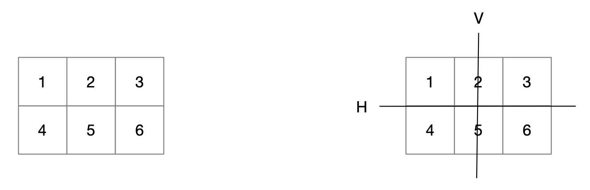
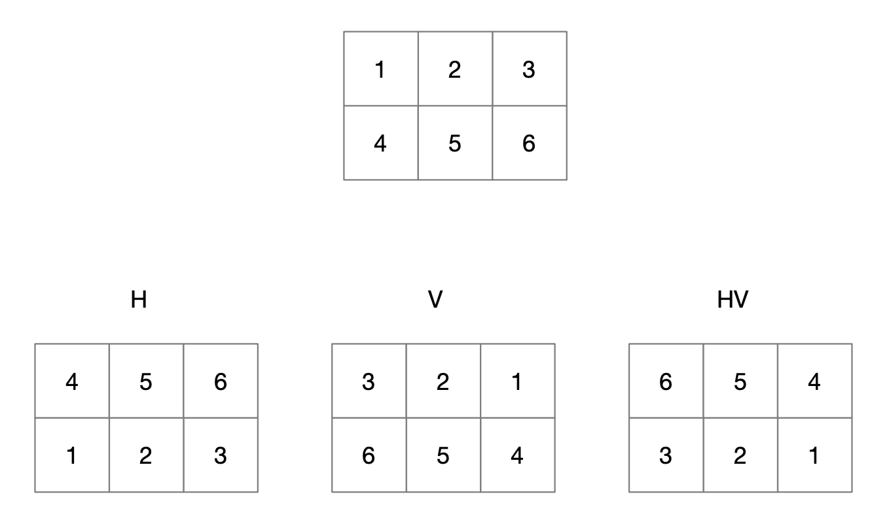
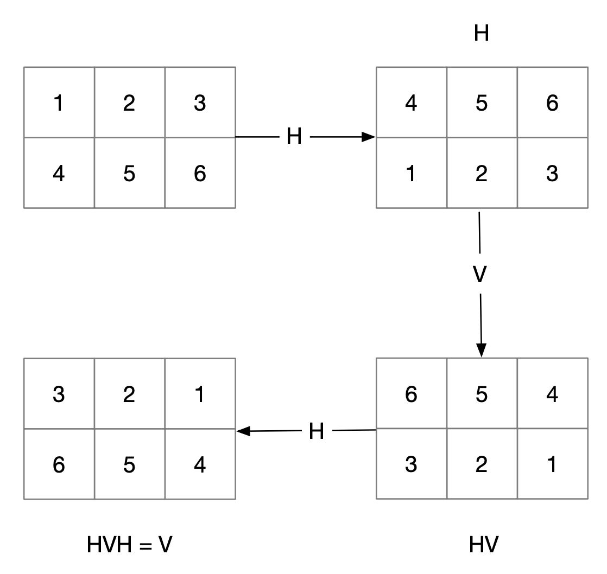
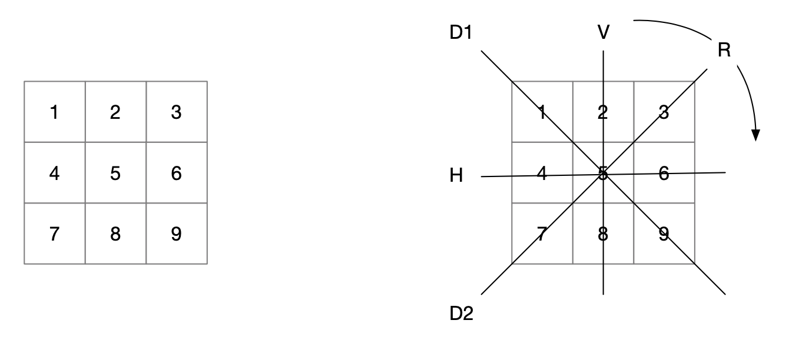
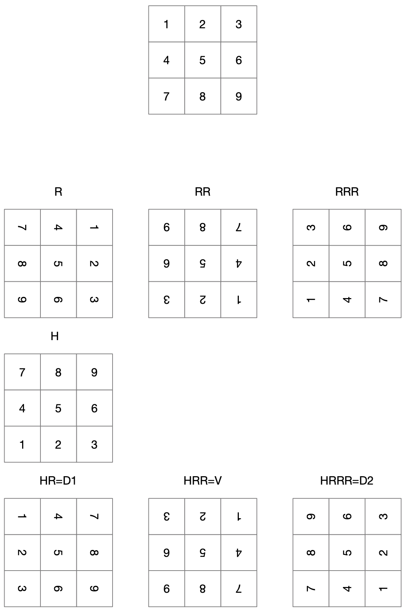
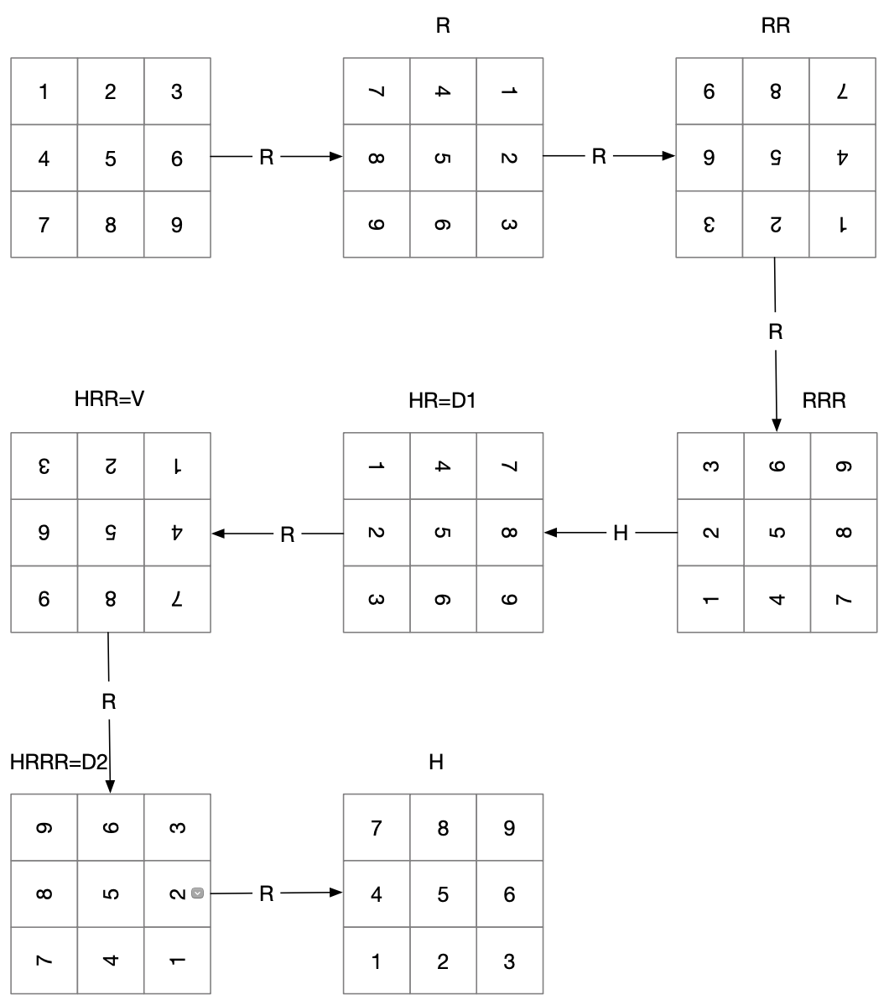

<center>
  <h1>ITI 1521. Introduction à l’informatique II</h1>
  <h3>Devoir 2</h3>
  <h3>Échéance: 09 jui 2020, 23 h 00</h3>
</center>

## Objectifs d’apprentissage

* Itérer à travers différents états
* Appliquer la technique de l’indirection

## Introduction

Pour le devoir précédent, nous avions autorisé le traitement des jeux symétriques. Dans cet devoir, nous supprimerons ces jeux symétriques pour rendre notre espace de recherche plus petit.

## Symétries et itérateurs

Lorsque nous avons créé notre liste de jeux pour la deuxième question du devoir 2, nous avons ajouté beaucoup de solutions qui étaient essentiellement identiques, simplement une symétrie des autres jeux déjà énumérés.

Examinons les symétries dans une grille de n × m. Supposons d’abord que n 􏰀 m, c’est-à-dire que la grille n’est pas carrée. Dans le cas d’une grille non carrée, nous avons essentiellement deux symétries : le basculement vertical et le basculement horizontal (Figure 1).


**Figure 1 : Les grilles non carrées ont deux axes de symétrie.**

Pour chaque grille non carrée n × m, il y a jusqu’à trois grilles différentes mais symétriques : celle obtenue avec une symétrie verticale, celle obtenue avec une symétrie horizontale, et celle obtenue avec une combinaison des deux symétries (Figure 2).


**Figure 2: Les grilles non carrées ont jusqu’à trois grilles symétriques équivalentes.**

Ce qui sera pratique, c’est qu’il est possible d’itérer à travers toutes ces symétries en appliquant des transforma- tions répétées, par exemple la série symétrie horizontale, puis verticale, puis horizontale vous donnera les quatre grilles, comme le montre Figure 3.


**Figure 3: Enumération de toutes les grilles symétriques non carrées.**

Les choses sont un peu plus compliquées lorsque la grille est carrée. En plus des symétries horizontales et verticales, nous avons les deux diagonales, ainsi que la rotation (Figure 4).


**Figure 4: Les grilles carrées ont 4 axes de symétrie, et peuvent également être tournées de 90 degrés.**

Chaque carré nous donne maintenant jusqu’à 7 autres grilles différentes mais symétriques, comme le montre la Figure 5.


**Figure 5: Les grilles carrées ont 7 grilles symétriques équivalents.**


Encore une fois, il est possible d’itérer à travers les 8 différentes grilles («carrées») mais équivalents et symétriques, par exemple avec la séquence rotation-rotation-rotation-symétrie horizontale - rotation-rotation-rotation-rotation, comme le montre la figure 6.


**Figure 6: Enumération de tous les grilles carrées symétriques.**

## Étape 1 : Créer Transfomer.java

Il ressort de la discussion ci-dessus que la mise en œuvre de la symétrie horizontale, de la symétrie verticale et de la rotation de 90 degrés (dans le sens des aiguilles d’une montre) est suffisante pour obtenir toutes les grilles symétriques possibles, qu’ils soient carrés ou non.  Nous allons créer une nouvelle classe Transformer pour gérer toutes les symétries de transformation.

```java
public class Transformer {

}
```

### Ajouter une énumération des types de rotation

Nous voulons ajouter une énumération de toutes les rotations possibles en créant une class `enum` dans notre classe `Transformer`.

```java
  /**
   * An static enum  for the types of
   * allowable transformations
   */
  public static enum Type {
    UNKNOWN,
    IDENTITY,
    ROTATION,
    VERTICAL_SYMMETRY,
    HORIZONAL_SYMMETRY,
  }
```

Le `UNKNOWN` est utile pour les tests, et le` IDENTITY` ne fait aucune rotation du tout.


### Mettre en œuvre les transformations

Nous allons ajouter cinq méthodes dans Transformer.java.

Cette méthode utilise l'énum ci-dessus et appelle les méthodes de transformation individuelles.

```java
  /**
   * Applies the transformation specified as parameter
   * to board
   *
   * If the transformation was successful return true, if not return false;
   */
  public static boolean transform(Type transformation, int numRows, int numColumns, int[] board) {

    switch(transformation) {
    case IDENTITY:
      return identity(numRows, numColumns, board);
    case ROTATION:
      return rotate90(numRows, numColumns, board);
    case VERTICAL_SYMMETRY:
      return verticalFlip(numRows, numColumns, board);
    case HORIZONAL_SYMMETRY:
      return horizontalFlip(numRows, numColumns, board);
    default:
      return false;
    }
  }
```

Conformément à notre approche précédente, les grilles vont être mémorisées à l’aide d’un tableau unidimensionnel. Pour des raisons qui deviendront très bientôt évidentes, nous utiliserons un tableau d’entiers pour notre grille. Chacune des méthodes aura trois paramètres : le nombre de lignes et le nombre de colonnes de la grille, et une référence au tableau d’entiers représentant la grille. Vous devez implémenter les méthodes de classe dans la classe Transformer.java, c’est-à-dire :

#### Identity

```java
public static boolean identity(int numRows, int numColumns, int[] board) {
```

Sets the board to the identity board where the value at each index is the index itself (in other words do a "no flip" flip).  Here we ignore the current values withiin the provided board and populate each index with its index value.

For example, the identity board of a 3x3 game is

```
 0 | 1 | 2
----------
 3 | 4 | 5
----------
 6 | 7 | 8
```

#### Inversé horizontale

```java
public static void horizontalFlip(int numRows, int numRows, int[] board)
```

Effectue une symétrie horizontale sur les éléments de la grille numRows × numRows enregistrés dans le tableau référé par board. Les éléments du tableau référencé par board sont modifiés en conséquence (voir l’exemple ci-dessous).

Si l'on considère une grille 3x3.

```
 1 | 2 | 3
----------
 4 | 5 | 6
----------
 7 | 8 | 9
```

La grille inversé horizontalement mis à jour serait

```
 7 | 8 | 9
----------
 4 | 5 | 6
----------
 1 | 2 | 3
```

#### Inversé vertical

```java
public static void verticalFlip(int numRows, int numRows, int[] board)
```

Effectue une symétrie verticale sur les éléments de la grille numRows × numRows enregistrés dans le tableau référencé par board. Les éléments du tableau référencé par board sont modifiés en conséquence (voir l’exemple ci-dessous).

Si l'on considère une grille 3x3.

```
 1 | 2 | 3
----------
 4 | 5 | 6
----------
 7 | 8 | 9
```

La grille inversé verticalement mis à jour serait

```
 3 | 2 | 1
----------
 6 | 5 | 4
----------
 9 | 8 | 7
```

#### Rotation à 90 degrés

```java
public static void rotate(int numRows, int numRows, int[] board);
```

Pivote de 90 degrés dans le sens des aiguilles d’une montre les éléments de la grille numRows × numRows enregistrés dans le tableau référencé par board. Les éléments du tableau référencé par board sont modifiés en conséquence (voir l’exemple ci-dessous).

Si l'on considère une grille 3x3.

```
 1 | 2 | 3
----------
 4 | 5 | 6
----------
 7 | 8 | 9
```

La nouvelle grille pivotée de 90 degrés serait

```
 7 | 4 | 1
 ----------
 8 | 5 | 2
 ----------
 9 | 6 | 3
```

Notez que vous ne pouvez faire pivotée que des grille n x n.


### Test manuel du Transformer

Toutes les méthodes doivent vérifier les entrées fournies et gérer tous les cas possibles selon les besoins. La classe Transformer.java à les tests suivants:


```java
  private static void test(int numRows, int numColumns) {
    int[] test;
    test = new int[numRows*numColumns];

    System.out.println("testing " + numRows + " numRows and " + numColumns + " numColumns.");

    identity(numRows, numColumns, test);
    System.out.println(java.util.Arrays.toString(test));

    horizontalFlip(numRows,numColumns,test);
    System.out.println("HF => " + java.util.Arrays.toString(test));

    horizontalFlip(numRows,numColumns,test);
    System.out.println("HF => " + java.util.Arrays.toString(test));

    verticalFlip(numRows,numColumns,test);
    System.out.println("VF => " + java.util.Arrays.toString(test));

    verticalFlip(numRows,numColumns,test);
    System.out.println("VF => " + java.util.Arrays.toString(test));

    for(int i = 0; i < 4; i++) {
      boolean didTransform = rotate90(numRows,numColumns,test);
      if (didTransform) {
        System.out.println("ROT => " + java.util.Arrays.toString(test));
      }
    }
  }

  public static void main(String[] args) {
    int[] test;
    int numRows, numColumns;

    test(2,2);
    test(2,3);
    test(3,3);
    test(4,3);
    test(4,4);
  }
```

L'exécution des tests ci-dessus devrait produire la sortie suivante:

```java
$ javac Transformer.java
$ java Transformer
```

La sortie ressemblerait à

```java
testing 2 numRows and 2 numColumns.
[0, 1, 2, 3]
HF => [2, 3, 0, 1]
HF => [0, 1, 2, 3]
VF => [1, 0, 3, 2]
VF => [0, 1, 2, 3]
ROT => [2, 0, 3, 1]
ROT => [3, 2, 1, 0]
ROT => [1, 3, 0, 2]
ROT => [0, 1, 2, 3]
testing 2 numRows and 3 numColumns.
[0, 1, 2, 3, 4, 5]
HF => [3, 4, 5, 0, 1, 2]
HF => [0, 1, 2, 3, 4, 5]
VF => [2, 1, 0, 5, 4, 3]
VF => [0, 1, 2, 3, 4, 5]
testing 3 numRows and 3 numColumns.
[0, 1, 2, 3, 4, 5, 6, 7, 8]
HF => [6, 7, 8, 3, 4, 5, 0, 1, 2]
HF => [0, 1, 2, 3, 4, 5, 6, 7, 8]
VF => [2, 1, 0, 5, 4, 3, 8, 7, 6]
VF => [0, 1, 2, 3, 4, 5, 6, 7, 8]
ROT => [6, 3, 0, 7, 4, 1, 8, 5, 2]
ROT => [8, 7, 6, 5, 4, 3, 2, 1, 0]
ROT => [2, 5, 8, 1, 4, 7, 0, 3, 6]
ROT => [0, 1, 2, 3, 4, 5, 6, 7, 8]
testing 4 numRows and 3 numColumns.
[0, 1, 2, 3, 4, 5, 6, 7, 8, 9, 10, 11]
HF => [9, 10, 11, 6, 7, 8, 3, 4, 5, 0, 1, 2]
HF => [0, 1, 2, 3, 4, 5, 6, 7, 8, 9, 10, 11]
VF => [2, 1, 0, 5, 4, 3, 8, 7, 6, 11, 10, 9]
VF => [0, 1, 2, 3, 4, 5, 6, 7, 8, 9, 10, 11]
testing 4 numRows and 4 numColumns.
[0, 1, 2, 3, 4, 5, 6, 7, 8, 9, 10, 11, 12, 13, 14, 15]
HF => [12, 13, 14, 15, 8, 9, 10, 11, 4, 5, 6, 7, 0, 1, 2, 3]
HF => [0, 1, 2, 3, 4, 5, 6, 7, 8, 9, 10, 11, 12, 13, 14, 15]
VF => [3, 2, 1, 0, 7, 6, 5, 4, 11, 10, 9, 8, 15, 14, 13, 12]
VF => [0, 1, 2, 3, 4, 5, 6, 7, 8, 9, 10, 11, 12, 13, 14, 15]
ROT => [12, 8, 4, 0, 13, 9, 5, 1, 14, 10, 6, 2, 15, 11, 7, 3]
ROT => [15, 14, 13, 12, 11, 10, 9, 8, 7, 6, 5, 4, 3, 2, 1, 0]
ROT => [3, 7, 11, 15, 2, 6, 10, 14, 1, 5, 9, 13, 0, 4, 8, 12]
ROT => [0, 1, 2, 3, 4, 5, 6, 7, 8, 9, 10, 11, 12, 13, 14, 15]
```

## Étape 2: Génération de tous les jeux non symétriques n × m

Dans le devoir 2, nous avons déjà créé une méthode qui génère tous les jeux possibles pour une taille de grille donnée. Cette méthode ajoutait un jeu à la liste uniquement si le jeu n’était pas égale à un jeu qui était déjà là. De ce point de vue, il suffit donc de modifier légèrement cette méthode pour n’ajouter un jeu que s’il n’est pas égale ou symétrique à un jeu qui existe déjà.

### Mettre à jour `equals` à inclure des grilles symétriques

Mettez à jour la méthode `equals` de` TicTacToe` pour considérer également les jeux symétriques comme égaux. Une fois mis à jour, le `generateAllGames` dans` TicTacToeEnumerations` générera la liste des listes que nous cherchons.

Si l'on considère une grille 3x3.

```
 X |   |
----------
   |   |
----------
   |   |
```

Il devrait être mis à jour afin que le tableau symétrique suivant soit également égal à

```
   |   | X
----------
   |   |
----------
   |   |
```

Continuez a lire pour savoir comment effectuer ce changement.


### Indirection

Afin d’implémenter `equals` dans `TicTacToe`, nous devrons passer en boucle tous les jeux symétriques possibles pour voir si nous avons une correspondance. Bien sûr, nous pourrions simplement appliquer les symétries sur le jeu lui-même. Nous appliquerions ainsi des transformations sur la grille jusqu’à ce qu’elle corresponde à la grille du jeu auquel nous la comparons (auquel cas elle est symétrique) ou que nous n’ayons plus de jeux symétriques (auquel cas elle n’est pas symétrique).

Cependant, changer le tableau lui-même peut avoir des effets secondaires non désirés. Par exemple, imaginez que nous imprimons le jeu à l’utilisateur. Ce qui se passerait, c’est que, puisque le jeu est basculé vers des jeux symétriques équivalents, le jeu présenté à l’utilisateur pourrait être un jeu différent mais symétrique à chaque fois, ce qui ne serait clairement pas souhaitable.

C’est pourquoi nous allons introduire un niveau d’indirection pour calculer nos symétries.

```java
  /**
   * The transformed board
   * Initialized as the identity (board), i.e. no changes
   * it will store the transformed index of each value
   * in the underlying board
   */
  int[] boardIndexes;

  /**
   * What are all the allowable transformations of this board
   * There are more transformations for square boards
   */
  int allowableIndex;
  Transformer.Type[] allowable;
```

Le tableau lui-même restera inchangé, mais nous utiliserons un autre tableau qui fera correspondre les indices du tableau à leurs emplacements symétriques actuels. Nous utiliserons une variable d’instance, le tableau d’entier `boardIndexes` pour enregistrer l’indirection.

Au départ, comme il n’y a pas de transformation, nous avons toujours `board[i]==board[boardIndexes[i]]` (la transformation d'identité). Mais après avoir appliqué quelques symétries au jeu, `boardIndexes[i]` enregistre où l’index `i` du jeu est mis en correspondance dans la symétrie.


### Itérer sur des tableaux symétriques

Pour itérer le tableau symétrique, nous avons besoin d'une stratégie. Chaque grille a quatre ou huit positions symétriques selon qu'elle est carrée ou non. Nous proposons un mécanisme pratique pour itérer toutes les positions possibles, en utilisant de nouvelles méthodes d'instance

```
  /**
   * Reset the board back to it's original position
   */
  public void reset() { ... }

  /**
   * Can we rotate the board anymore?
   */
  public boolean hasNext() { ... }

  /**
   * Rotate the board to based on the next allowable rotation
   */
  public boolean next() { ... }
```

* `hasNext()` retourne true si et seulement si un appel à la méthode next réussirait, et false sinon.
* `next()` transformera les `boardIndexes` de la grille pour correspondre à la prochaine transformation disponible, elle va retourner `true` si cela était possible et `false` s'il ne reste plus d'itérations.
* `reset()` remet le `boardIndexes` dans l'état initial `identity`

Le programme Java suivant illustre l’utilisation souhaitée pour next, et reset (notez que `hasNext` n'était pas nécessaire car `next` effectue le vérification pour nous). La méthode `toString` a été mise à jour pour renvoyer la version transformée du jeu.

```java
public class Test {

  private static void printTest(TicTacToe g) {
    System.out.println("PRINTING GAME");
    g.reset();
    while (g.next()) {
      System.out.println(g.toString());
      System.out.println("");
    }

    System.out.println("reset:");
    g.reset();
    while (g.next()) {
      System.out.println(g.toString());
      System.out.println("");
    }
    System.out.println("DONE PRINTING GAME");
  }

  public static void main(String[] args) {
    TicTacToe g;

    System.out.println("Test on a 3x3 game");
    g = new TicTacToe();
    g.play(0);
    g.play(2);
    g.play(3);
    printTest(g);

    printTest(g);
    System.out.println("Test on a 5x4 game");
    g = new TicTacToe(4,5,3);
    g.play(0);
    g.play(2);
    g.play(3);
    printTest(g);
  }
}
```

Les sorties d'exécution de code sont ci-dessus:

```
Test on a 3x3 game
PRINTING GAME
   | X | O
-----------
   |   |
-----------
   |   |

   |   |
-----------
   |   | X
-----------
   |   | O

   |   |
-----------
   |   |
-----------
 O | X |

 O |   |
-----------
 X |   |
-----------
   |   |

   |   |
-----------
 X |   |
-----------
 O |   |

 O | X |
-----------
   |   |
-----------
   |   |

   |   | O
-----------
   |   | X
-----------
   |   |

   |   |
-----------
   |   |
-----------
   | X | O

reset:
   | X | O
-----------
   |   |
-----------
   |   |

   |   |
-----------
   |   | X
-----------
   |   | O

   |   |
-----------
   |   |
-----------
 O | X |

 O |   |
-----------
 X |   |
-----------
   |   |

   |   |
-----------
 X |   |
-----------
 O |   |

 O | X |
-----------
   |   |
-----------
   |   |

   |   | O
-----------
   |   | X
-----------
   |   |

   |   |
-----------
   |   |
-----------
   | X | O

DONE PRINTING GAME
PRINTING GAME
   | X | O
-----------
   |   |
-----------
   |   |

   |   |
-----------
   |   | X
-----------
   |   | O

   |   |
-----------
   |   |
-----------
 O | X |

 O |   |
-----------
 X |   |
-----------
   |   |

   |   |
-----------
 X |   |
-----------
 O |   |

 O | X |
-----------
   |   |
-----------
   |   |

   |   | O
-----------
   |   | X
-----------
   |   |

   |   |
-----------
   |   |
-----------
   | X | O

reset:
   | X | O
-----------
   |   |
-----------
   |   |

   |   |
-----------
   |   | X
-----------
   |   | O

   |   |
-----------
   |   |
-----------
 O | X |

 O |   |
-----------
 X |   |
-----------
   |   |

   |   |
-----------
 X |   |
-----------
 O |   |

 O | X |
-----------
   |   |
-----------
   |   |

   |   | O
-----------
   |   | X
-----------
   |   |

   |   |
-----------
   |   |
-----------
   | X | O

DONE PRINTING GAME
Test on a 5x4 game
PRINTING GAME
   | X | O |   |
-------------------
   |   |   |   |
-------------------
   |   |   |   |
-------------------
   |   |   |   |

   |   |   |   |
-------------------
   |   |   |   |
-------------------
   |   |   |   |
-------------------
   | X | O |   |

   |   |   |   |
-------------------
   |   |   |   |
-------------------
   |   |   |   |
-------------------
   |   | O | X |

   |   | O | X |
-------------------
   |   |   |   |
-------------------
   |   |   |   |
-------------------
   |   |   |   |

reset:
   | X | O |   |
-------------------
   |   |   |   |
-------------------
   |   |   |   |
-------------------
   |   |   |   |

   |   |   |   |
-------------------
   |   |   |   |
-------------------
   |   |   |   |
-------------------
   | X | O |   |

   |   |   |   |
-------------------
   |   |   |   |
-------------------
   |   |   |   |
-------------------
   |   | O | X |

   |   | O | X |
-------------------
   |   |   |   |
-------------------
   |   |   |   |
-------------------
   |   |   |   |

DONE PRINTING GAME
```

Nous n'avons besoin que de trois transformations pour identifier les jeux symétriques:

* symétrie verticale (`VERTICAL_SYMMETRY`)
* symétrie horizontale (`HORIZONAL_SYMMETRY`)
* Rotation à 90 degrés (`ROTATION`)

Nous devons également avoir un `reset` pour démarrer (et réinitialiser) le jeu dans son état d'origine

* transformation de l'identité (`IDENTITY`)

#### Mettez à jour Transformer pour déterminer les transformations autorisées

Mettez à jour `Transformer` pour renvoyer un tableau de `Transformer.Type`s basé sur le
règles ci-dessus dans

```
public static Type[] symmetricTransformations(int numRows, int numColumns) {
```

Suite à un appel à la méthode `reset()`, chaque appel à la méthode `next()` modifie l'orientation du jeu en fonction de la liste d'opérations suivante:

##### Grille non carrées

* IDENTITY
* HORIZONAL_SYMMETRY
* VERTICAL_SYMMETRY
* HORIZONAL_SYMMETRY

##### Grilles carrées

* IDENTITY
* ROTATION
* ROTATION
* ROTATION
* HORIZONAL_SYMMETRY
* ROTATION
* ROTATION
* ROTATION


#### Mettre à jour TicTacToe pour prendre en charge les transformations

Ajoutez toutes les variables d'instance nécessaires pour implémenter les méthodes:

* `hasNext`,
* `next`, et
* `reset`

Mettez à jour la méthode `equals` qui retourne vrai si et seulement si cette instance de` TicTacToe` et `other` sont identiques, y compris les grilles symétriques en utilisant les méthodes ci-dessus.

La méthode de classe `generateAllGames` dans `TicTacToeEnumerations` est déjà
implémenté et utilise la méthode `equals` pour générer la liste des jeux.

Voici quelques exécutions avec la mis à jour de la méthode `equals`.


```java
java EnumerationsMain
```

Sorti


```bash
======= level 0 =======: 1 element(s) (1 still playing)
======= level 1 =======: 3 element(s) (3 still playing)
======= level 2 =======: 12 element(s) (12 still playing)
======= level 3 =======: 38 element(s) (38 still playing)
======= level 4 =======: 108 element(s) (108 still playing)
======= level 5 =======: 174 element(s) (153 still playing)
======= level 6 =======: 204 element(s) (183 still playing)
======= level 7 =======: 153 element(s) (95 still playing)
======= level 8 =======: 57 element(s) (34 still playing)
======= level 9 =======: 15 element(s) (0 still playing)
that's 765 games
91 won by X
44 won by O
3 draw
```

Un autre exemple

```java
java EnumerationsMain 4 4 2
```

Sorti

```
======= level 0 =======: 1 element(s) (1 still playing)
======= level 1 =======: 3 element(s) (3 still playing)
======= level 2 =======: 33 element(s) (33 still playing)
======= level 3 =======: 219 element(s) (141 still playing)
======= level 4 =======: 913 element(s) (587 still playing)
======= level 5 =======: 3338 element(s) (883 still playing)
======= level 6 =======: 4702 element(s) (1217 still playing)
======= level 7 =======: 7048 element(s) (511 still playing)
======= level 8 =======: 2724 element(s) (194 still playing)
======= level 9 =======: 1119 element(s) (0 still playing)
that's 20100 games
10189 won by X
6341 won by O
0 draw
```

## Soumission

Veuillez lire attentivement les [Directives de soumission](SUBMISSION.fr.md).

Les erreurs de soumission affecteront vos notes.

Soumettez les fichiers suivante.

* STUDENT.md
* TicTacToe.java
* Transformer.java

Cette soumission peut se faire en groupe de 2 +/- 1 personne. Assurez-vous que `STUDENT.md` inclut les noms de tous les participants; ne soumettez qu'une seule solution par groupe.


## Intégrité académique

Cette partie du devoir vise à sensibiliser les étudiants au plagiat et à l’intégrité académique. Veuillez lire les documents suivants.


* https://www.uottawa.ca/administration-et-gouvernance/reglement-scolaire-14-autres-informations-import
* https://www.uottawa.ca/vice-recteur-etudes/integrite-etudes

Les cas de plagiat seront traités conformément au règlement de l’université. En soumettant ce travail, vous reconnaissez :

1. J’ai lu le règlement académique sur la fraude académique.
2. Je comprends les conséquences du plagiat.
3. À l’exception du code source fourni par les instructeurs pour ce cours, tout le code source est le mien.
4. Je n’ai collaboré avec aucune autre personne, à l’exception de mon partenaire dans le cas d’un travail d’équipe.

* Si vous avez collaboré avec d’autres personnes ou obtenu le code source sur le Web, veuillez alors indiquer le nom de vos collaborateurs ou la source de l’information, ainsi que la nature de la collaboration. Mettez ces informations dans le fichier STUDENT.md. Des points seront déduits proportionnellement au niveau de l’aide fournie (de 0 à 100%).
